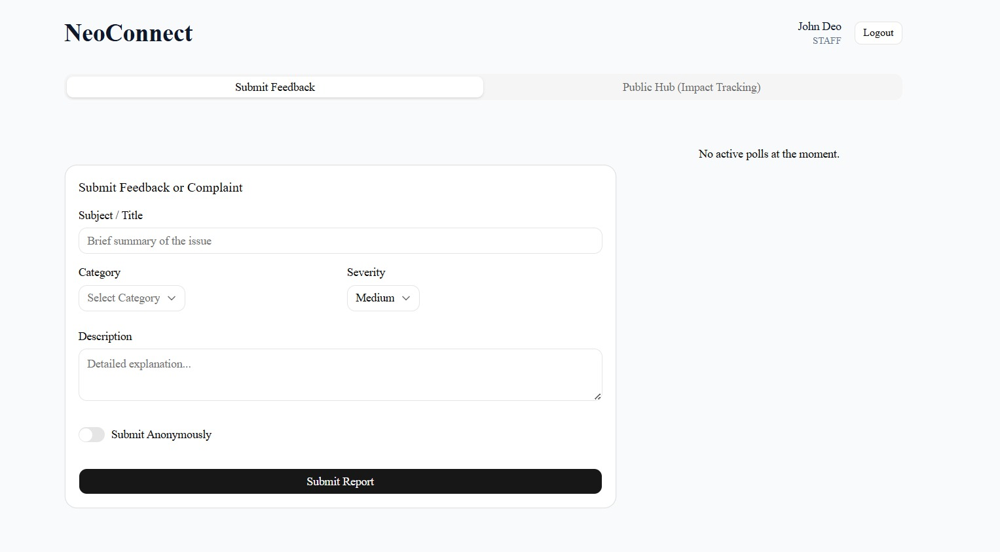

# 🏛️ NeoConnect - Backend API

### 🔗 [Live API Endpoint](https://neoconnect-api.onrender.com)

This repository contains the server-side logic and database schemas for the NeoConnect system.
---
## 📸 App Preview

### Management Dashboard & Analytics

*Real-time departmental analytics with automated red-flagging for hotspots.*

### Staff Submission Portal

*User-friendly submission form with anonymous reporting options.*

### Secure Authentication

*Role-based access control for Staff, Secretariat, and Case Managers.*
---
  
## 📊 Business Logic Implementation

### 🔄 Case Lifecycle
The system strictly enforces a state-driven workflow to ensure accountability:

> **New** ➔ **Assigned** ➔ **In Progress** ➔ **Resolved** (or **Escalated**)

### 🚩 Hotspot Detection (High-Priority Alerting)
To help management prioritize resources, the system implements an automated "Hotspot" algorithm:
* **Logic:** The backend aggregates active cases grouped by `department`.
* **Threshold:** If $Count(Department) \ge 5$, the department is flagged.
* **UI Feedback:** The Recharts Bar Chart dynamically changes the bar color to **Red** (`#ef4444`) and triggers a "⚠️ Immediate Attention" warning in the Management Dashboard.

### ⏳ 7-Day Auto-Escalation
NeoConnect ensures no grievance is ignored through a time-based escalation trigger:
* **Trigger:** A daily cron-style check (or manual trigger) compares the `createdAt` timestamp with the current Date.
* **Condition:** $$(CurrentDate - CreatedDate) > 7 \text{ days} \text{ AND } Status = \text{'New'}$$
* **Result:** The system automatically updates the status to **'Escalated'**, moves the case to the top of the priority queue, and alerts the Secretariat.

## 🛠️ Tech Stack
* **Server:** Node.js & Express.js
* **Database:** MongoDB (Mongoose ODM)
* **Security:** JSON Web Tokens (JWT)

## ⚙️ Setup Instructions
1. `npm install`
2. Create `.env` with `MONGO_URI` and `JWT_SECRET`.
3. `node server.js`